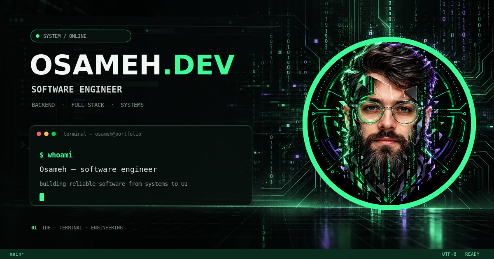
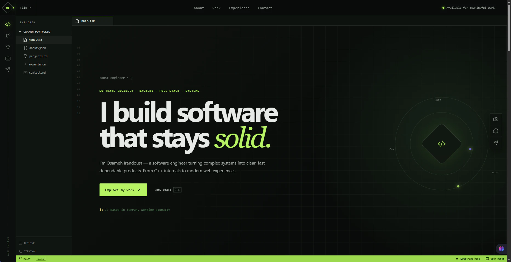
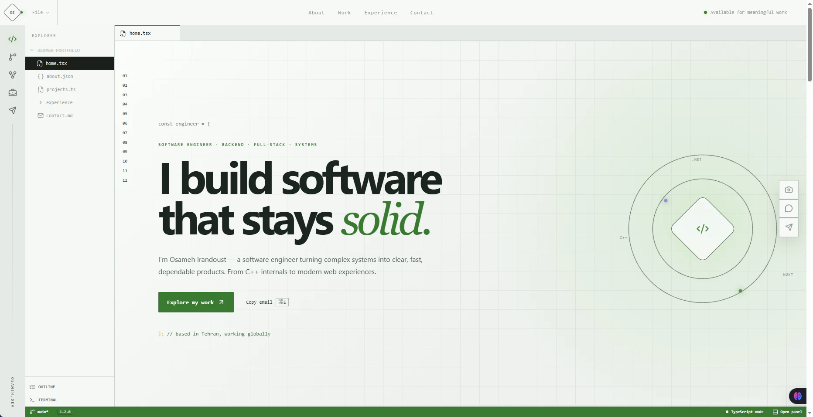
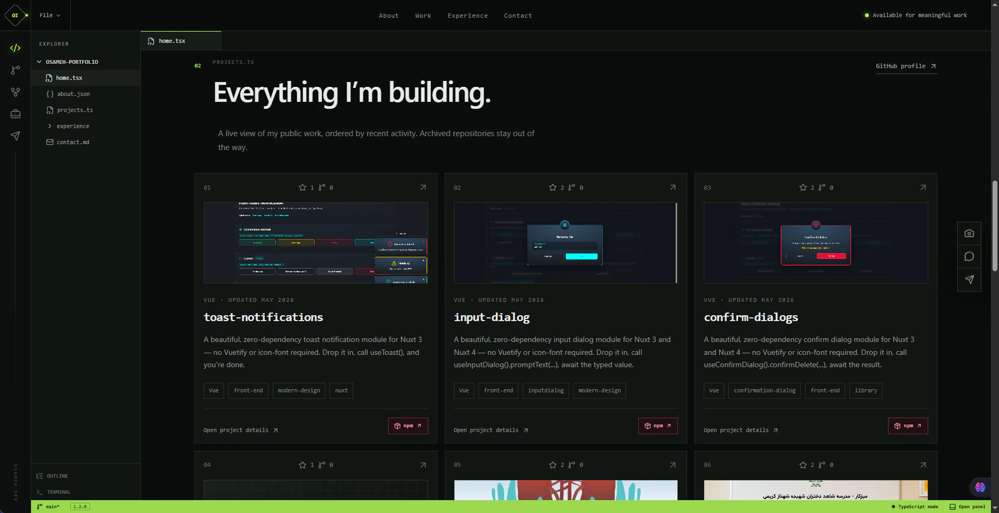
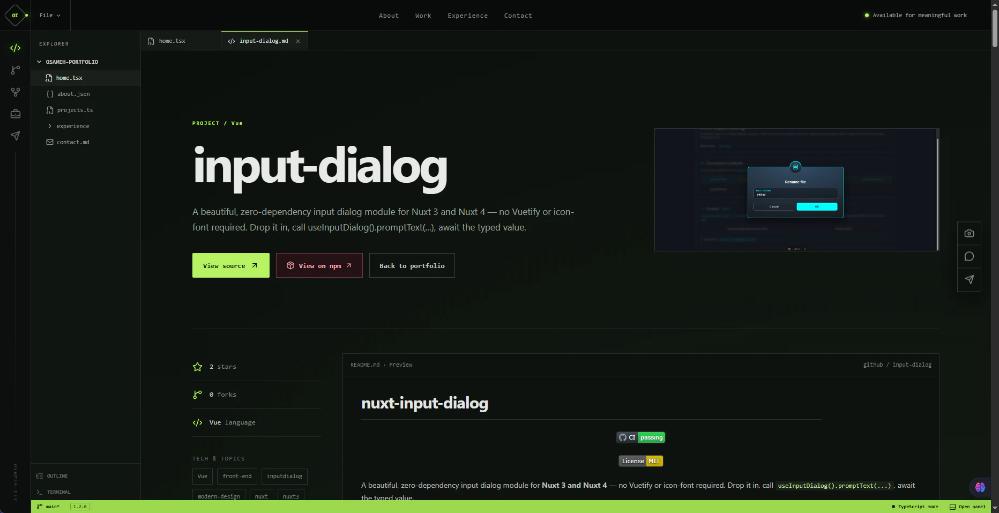
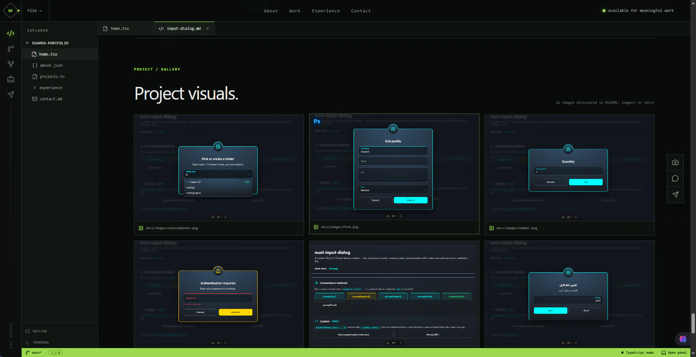
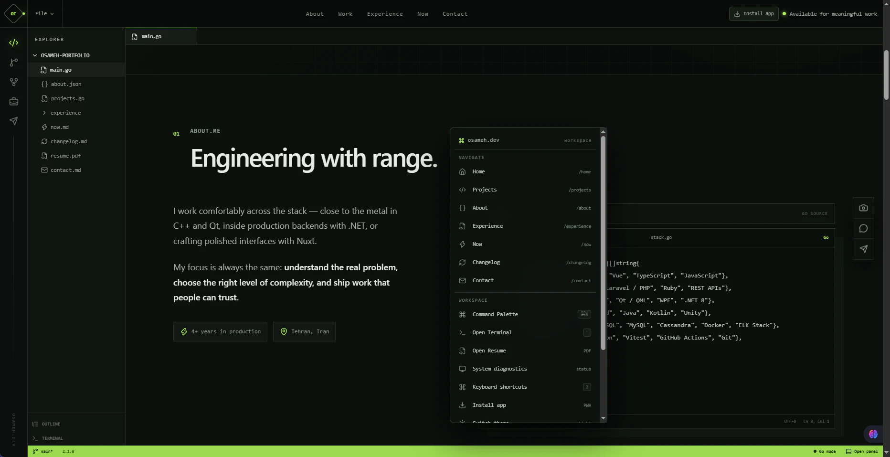
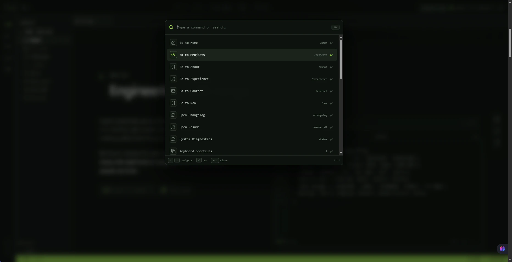
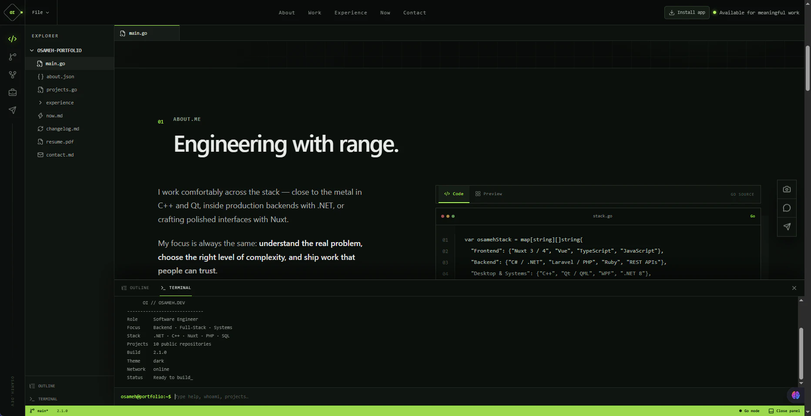
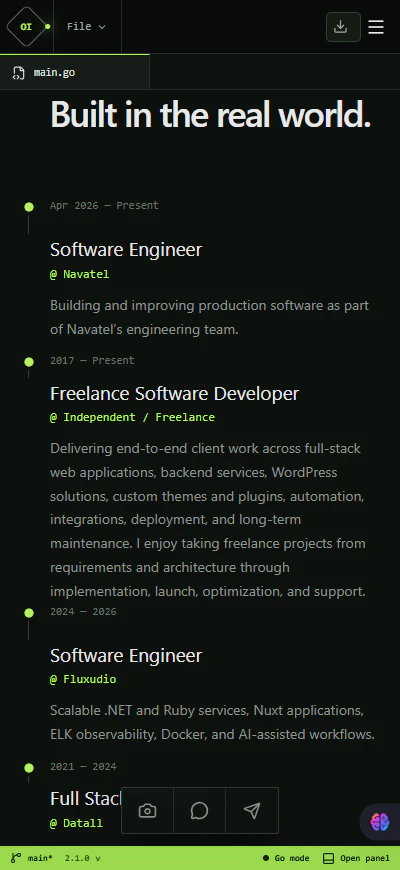

# osameh.dev — Portfolio OS



Production source for **[osameh.dev](https://osameh.dev)** — an IDE-inspired software engineering portfolio designed to behave more like a small developer workspace than a static resume page.

The site keeps the original dark/light visual language, editor layout, animations, terminal, project gallery, GitHub integration, and custom context menu, while adding production-grade reliability, security, SEO, offline support, and interactive portfolio features.

## Highlights

- **Live GitHub projects** through a same-origin PHP proxy with a fine-grained read-only token, origin caching, stale-cache fallback, README rendering, and repository image discovery.
- **Project case studies** with problem, solution, architecture, engineering challenges, and results.
- **Project search, technology filters, sorting, stack explorer, and two-project comparison.**
- **Automatic project galleries** from README images and repository `images/`, `docs/`, `screenshots/`, and `media/` folders.
- **Project deep links** such as `/projects/Mizekar`, with server-side Open Graph metadata and branded 1200×630 project social cards. The card composer uses a real repository visual when PHP GD is available and falls back safely to the main social cover otherwise.
- **Resume experience** with an in-site summary plus the packaged PDF at `/resume/Osameh_Irandoust_CV.pdf`.
  - Before a public release, keep `public/resume/Osameh_Irandoust_CV.pdf` replaced with the latest canonical copy of the resume.
- **GitHub activity feed**, `/now` section, and a visible portfolio changelog.
- **Custom desktop context menu** and **VS Code-style Command Palette** (`Ctrl/Cmd + K`).
- **Developer terminal** (`\`` shortcut) with commands such as `neofetch`, `projects`, `resume`, `status`, `share <repo>`, and `sudo hire osameh`.
- **Keyboard-first navigation** (`G` then `P/A/E/N/C`, `/` to focus project search, `?` for shortcuts).
- **PWA/offline shell** with install support and cached navigation/assets.
- **Secure contact form** with same-origin CSRF validation, honeypot protection, server-side validation, and IP-based rate limiting.
- **Privacy-friendly analytics** that store aggregate event/path counters only — no user IDs, cookies, user-agent fingerprints, or raw IP addresses.
- **Local system diagnostics** showing build, network/API status, PWA registration, viewport, theme, and build timestamp.
- **Custom developer-style real HTTP 404 state**, offline state, stale GitHub fallbacks, and build fingerprints for CDN troubleshooting.

## Architecture

```text
Browser / PWA
   |
   | HTTPS
   v
ParsPack CDN
   |
   v
Shared Linux Hosting
   |
   +-- React + Vite static application
   |      +-- IDE UI / animations / themes
   |      +-- command palette + terminal
   |      +-- search / filters / compare
   |      +-- case studies / galleries / resume
   |      +-- PWA service worker
   |
   +-- PHP runtime
          +-- /api/github/*   -> GitHub REST API
          +-- /api/contact    -> mail service
          +-- /api/analytics  -> aggregate counters
          +-- /project.php    -> per-project social metadata
          |
          +-- private server storage
                 +-- GitHub token
                 +-- GitHub/API cache
                 +-- social metadata cache
                 +-- contact rate-limit data
                 +-- aggregate analytics
```

## Stack

- React 19
- TypeScript
- Vite
- Tailwind CSS 4 + existing custom CSS/animations
- `marked` + DOMPurify for sanitized README rendering
- PHP 8+ shared-host APIs
- GitHub REST API
- ParsPack CDN
- PWA / Service Worker

## GitHub data flow

The browser never receives the GitHub token.

```text
Browser
  -> https://osameh.dev/api/github/...
  -> PHP proxy
  -> server-side GITHUB_TOKEN
  -> GitHub REST API
```

The proxy provides:

- repository list cache: 15 minutes
- README cache: 6 hours, with stale fallback
- gallery discovery cache: 6 hours
- recent public activity cache: 15 minutes
- allow-list validation so arbitrary repository names cannot consume the authenticated API quota

## Runtime secret

Preferred environment variable:

```bash
GITHUB_TOKEN=github_pat_xxxxxxxxx
```

On shared hosting where custom environment variables are unavailable, create this file **outside the web root**:

```text
domains/osameh.dev/private/osameh-portfolio-secrets.php
```

```php
<?php
return [
    'GITHUB_TOKEN' => 'github_pat_xxxxxxxxx',
];
```

The token should only have the minimum read permission required for public repository content.

## Local development

```bash
npm install
npm run dev
```

Production build:

```bash
npm run build
```

Local production preview:

```bash
npm run preview
```

> Use `npm run preview` rather than double-clicking `dist/index.html`. Production assets intentionally use root-relative URLs so deep routes such as `/projects/Mizekar` work correctly.

## Deployment

Upload the **contents of `dist/`** to `public_html/`.

Expected hosting layout:

```text
domains/osameh.dev/
├── private/
│   └── osameh-portfolio-secrets.php
├── private_html -> public_html
└── public_html/
    ├── index.html
    ├── .htaccess
    ├── project.php
    ├── sw.js
    ├── manifest.webmanifest
    ├── build-info.json
    ├── assets/
    ├── api/
    ├── icons/
    └── resume/
```

After deployment, purge the ParsPack CDN cache and compare the UI build badge against:

```text
https://osameh.dev/build-info.json
```

See [DEPLOYMENT.md](DEPLOYMENT.md) for the full production checklist.

## Terminal commands

```text
help                 command reference
whoami               profile summary
neofetch              portfolio system summary
ls                    open IDE tabs
exp                   work history
skills                technology stack
projects              jump to project explorer
cat <repo>            open repository
resume / cv            open resume viewer
now                    current focus
changelog              portfolio release history
status / diagnostics   local system diagnostics
shortcuts / keys       keyboard map
install / pwa          request PWA install prompt
share <repo>           share a project deep link
theme                  toggle light/dark theme
open <service>         GitHub / LinkedIn / Telegram / etc.
search <text>          search site routes/projects
version                deployed build ID
sudo hire osameh       easter egg
sudo su                another easter egg
clear                  clear terminal
```

The existing **backtick (`\``)** shortcut remains the terminal toggle, and opening the terminal always focuses the command input automatically.

## Security baseline

- HTTPS + HSTS
- same-origin API access through CSP
- no GitHub token in frontend JavaScript
- DOMPurify sanitization for GitHub README HTML
- strict project/repository allow-listing
- `X-Content-Type-Options: nosniff`
- clickjacking protection
- restrictive Permissions Policy
- no directory indexes
- contact CSRF token + honeypot + validation + rate limit
- private analytics/cache/secret directories outside `public_html`
- API responses request `no-store` from browser/CDN

## Social preview

The main URL uses:

```text
/public/og-cover-social.jpg   1200x630 JPEG
```

Project routes are intercepted by `project.php`. It reads the built `index.html` and injects project-specific title, description, canonical, and Open Graph metadata. The `og:image` points to `/og/projects/<repo>.jpg`, handled by `project-og.php`.

When the hosting PHP runtime has the GD extension, the image endpoint generates and caches a branded **1200×630 JPEG** using the project name, stack metadata, and a useful image discovered from the repository `images/`, `docs/`, `screenshots/`, or `media/` folders. If GD is unavailable, it redirects safely to the main portfolio cover.

That means links such as:

```text
https://osameh.dev/projects/Mizekar
https://osameh.dev/projects/Dialysis
```

can produce their own link preview without requiring SSR/Node.js.

## PWA / offline behavior

`manifest.webmanifest` + `sw.js` provide:

- install prompt where supported
- cached application shell
- cached static images/assets
- cached navigation fallback during connectivity loss
- network-only API calls so dynamic GitHub/contact responses are not accidentally persisted by the service worker

## Contact form

`POST /api/contact` sends messages to the portfolio email address using the hosting mail service.

Protection includes:

- same-origin check
- PHP session CSRF token
- hidden honeypot
- server-side length/email validation
- maximum 4 accepted attempts per IP/hour
- no message database or long-term message storage in the website

If `mail()` is disabled by the hosting provider, the UI falls back to showing the direct email address and the endpoint returns a clear error instead of pretending the message was delivered.

## Privacy-friendly analytics

The site records aggregate counters only for events such as:

- page views
- project opens
- project shares
- project comparisons
- resume opens
- contact submissions
- PWA installs

It intentionally does **not** store raw IP addresses, cookies, device fingerprints, or user-agent strings. Daily aggregate JSON files live outside the web root.

## README screenshots

The cover above is already included. I intentionally did not fabricate browser screenshots of the live site.

A ready-to-use folder exists at:

```text
docs/img/
```

When you take real screenshots, use these filenames so the repository stays consistent:

```text
docs/img/home-dark.webp
docs/img/home-light.webp
docs/img/projects.webp
docs/img/project-detail.webp
docs/img/project-gallery.webp
docs/img/context-menu.webp
docs/img/command-palette.webp
docs/img/terminal-neofetch.webp
docs/img/mobile.webp
```

Recommended capture width: **1440 px** for desktop and **390 px** for mobile. Export as WebP around 80-85% quality.

See [`docs/img/README.md`](docs/img/README.md) for the suggested screenshot checklist.

Once the files exist, this ready-made Markdown can be pasted directly under this section (the filenames are already synchronized with `docs/img/README.md`):

```md
| Dark workspace | Light workspace |
|---|---|
|  |  |








```

## Release history

### v2.0.1 — Build UX & compile fixes

- build version opens an in-app modal instead of raw JSON
- `build` opens the build modal from Terminal
- `version` stays text-only in Terminal
- fixed React event-handler typing for Home navigation
- fixed GitHub activity icon compatibility with `lucide-react`

### v2.0.0 — Portfolio OS

- project case studies
- project search/filter/sort/compare
- stack explorer
- resume viewer + downloadable PDF
- recent GitHub activity
- Now and Changelog sections
- PWA/offline shell
- secure contact workflow
- system diagnostics
- expanded terminal commands + `neofetch`
- keyboard navigation and shortcut guide
- project sharing
- server-side project Open Graph metadata
- privacy-friendly aggregate analytics

### v1.3.0

- custom context menu
- Command Palette
- terminal autofocus
- stable project deep links

### v1.2.0

- gallery/image discovery
- production build fingerprints
- hardened social preview
- GitHub API proxy/cache

## License / repository visibility

The repository can remain private while the production build is deployed. If you later make it public, review the git history first and confirm that no real secrets, `.env` values, hosting credentials, or GitHub tokens were ever committed.


### Build information modal

Clicking the build version in the footer or status bar opens an in-app build details modal. The terminal command `build` opens the same modal, while `version` prints the current version/build ID directly in the terminal.
