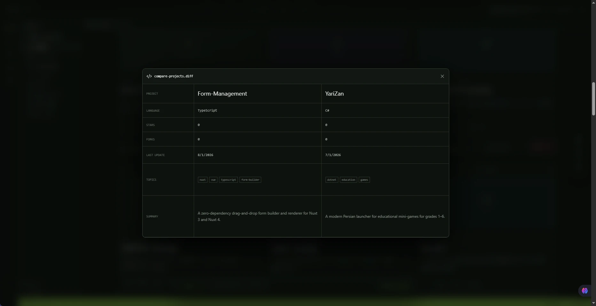
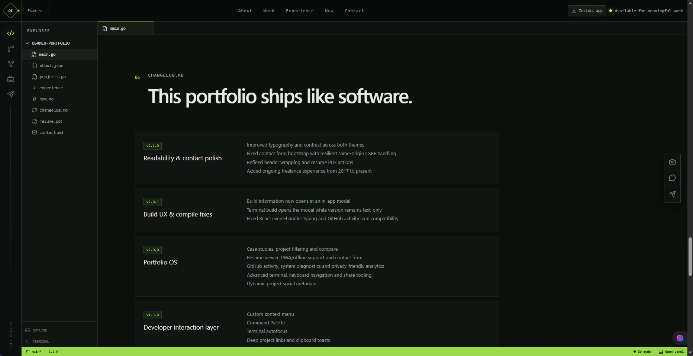
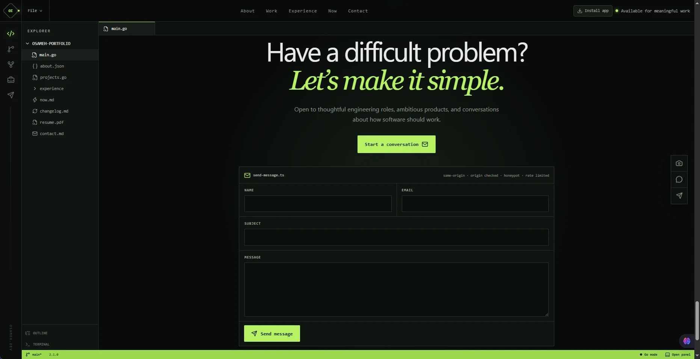

# osameh.dev


A production portfolio for **Osameh Irandoust**, designed as an IDE-inspired workspace rather than a conventional résumé page. The site combines a static React/Vite frontend with a small PHP backend for GitHub data, contact delivery, analytics, dynamic social cards, and shared-hosting integration.

**Live:** https://osameh.dev

## Highlights

- Responsive IDE-style interface with dark and light themes
- Dynamic public GitHub repositories, README rendering, repository metadata, and project galleries
- Project case studies, search, technology filters, sorting, and two-project comparison
- Context-aware custom context menu and `Ctrl/Cmd + K` Command Palette
- Interactive terminal with the backtick (`) shortcut, autofocus, resize/maximize support, and developer commands
- Built-in resume viewer and packaged PDF CV
- Installable PWA with offline shell and service worker
- Secure contact form with same-origin checks, CSRF protection, honeypot validation, and rate limiting
- Dynamic Open Graph metadata and per-project social preview cards
- Privacy-friendly aggregate analytics without cookies or visitor identifiers
- Build fingerprints and diagnostics for CDN/deployment troubleshooting
- CDN-friendly immutable asset caching with no-store handling for dynamic APIs

## Screenshots

Production screenshots are committed under `docs/img/` and render directly on GitHub.

<table>
  <tr>
    <td></td>
    <td></td>
  </tr>
  <tr>
    <td></td>
    <td></td>
  </tr>
  <tr>
    <td></td>
    <td></td>
  </tr>
  <tr>
    <td></td>
    <td></td>
  </tr>
  <tr>
    <td></td>
    <td></td>
  </tr>
  <tr>
    <td></td>
    <td></td>
  </tr>
</table>

## Architecture

```text
Browser / PWA
      │
      ▼
ParsPack CDN
      │
      ▼
Shared Linux Hosting
      │
      ├── React + Vite static frontend
      │     ├── portfolio UI
      │     ├── project explorer
      │     ├── case studies
      │     ├── gallery / lightbox
      │     ├── Command Palette
      │     ├── terminal
      │     └── resume / diagnostics
      │
      └── PHP endpoints
            ├── GitHub proxy + origin cache
            ├── contact form
            ├── aggregate analytics
            ├── dynamic project metadata
            └── dynamic project OG cards
                  │
                  ▼
              GitHub REST API
```

The frontend never receives the GitHub token. API authentication stays server-side and the browser communicates with same-origin endpoints under `/api/`.

## GitHub integration

Public repositories are loaded dynamically from the GitHub API and sorted by recent activity. Archived repositories and the GitHub profile repository are excluded.

For each project the portfolio can load:

- repository metadata and topics
- README content
- a sanitized Markdown preview
- repository images and screenshots
- recent public GitHub activity
- project-specific social metadata

The gallery scans image files across the authored repository tree, including root-level images and folders such as `images/`, `docs/`, `screenshots/`, `media/`, and `assets/`. Generated/dependency directories such as `node_modules`, `vendor`, `dist`, `build`, `bin`, `obj`, and coverage/cache folders are ignored.

Repository images referenced with relative Markdown paths are normalized to the correct raw GitHub URL. This includes forms such as:

```text
./docs/Screenshots/main.png
/docs/Screenshots/main.png
Images/splash_screen.jpg
/Images/splash_screen.jpg
```

README HTML is rendered with `marked` and sanitized with DOMPurify before being inserted into the page.

## Public repository behavior

This source tree is safe to publish **only after confirming that no secrets have ever been committed to Git history**.

If this portfolio repository becomes public:

- GitHub will naturally expose the complete source tree through the repository itself.
- `osameh.dev` will automatically discover the public repository through the existing GitHub integration unless it is explicitly excluded.
- Its README can be rendered as a project README inside the portfolio.
- Images committed to the repository can be discovered by the gallery API.
- The portfolio site does **not** attempt to render every source-code file as an in-browser code explorer; the project view intentionally focuses on metadata, case study, README, visuals, and links back to the full GitHub source.

## Tech stack

### Frontend

- React 19
- TypeScript
- Vite
- Tailwind CSS 4 utilities / existing custom design system
- Lucide icons
- `marked`
- DOMPurify

### Backend / hosting

- PHP 8+
- Apache / `.htaccess`
- ParsPack shared hosting
- ParsPack CDN
- GitHub REST API

### Browser features

- Web App Manifest / PWA install
- Service Worker
- Web Share API with clipboard fallback
- Clipboard API
- IntersectionObserver
- History API / deep project URLs
- keyboard-first navigation

## Terminal

The terminal opens with the existing backtick (`) shortcut and focuses the command field immediately.

Useful commands:

```text
help
whoami
neofetch
ls
exp
skills
projects
cat <repo>
contact
open <service>
search <text>
version
build
resume
now
changelog
status
install
shortcuts
share <repo>
hire
clear
```

`version` prints the deployed version in the terminal. `build` opens the build-information modal.

The terminal panel can be vertically resized by dragging its top handle, maximized/restored from the panel controls, or maximized by double-clicking the resize handle.

## Keyboard navigation

```text
Ctrl/Cmd + K   Command Palette
`              Toggle terminal
G then H       Home
G then A       About
G then P       Projects
G then E       Experience
G then N       Now
G then C       Contact
/              Focus project search
?              Keyboard shortcuts
Esc            Close active modal/tab
```

Command Palette keyboard selection automatically follows the active item while scrolling through long result lists.

## Notifications

User-facing operational feedback is routed through a shared toast system with separate visual states for:

- success
- information
- warning
- error

This includes contact submission results, clipboard failures, connectivity changes, PWA installation feedback, unavailable GitHub activity, and invalid terminal actions.

## Contact form

`POST /api/contact` provides the production contact endpoint. Protection includes:

- same-origin validation
- `Sec-Fetch-Site` checks
- CSRF token/cookie validation when available
- honeypot field
- server-side input validation
- IP-based rate limiting
- no-store response headers

The file label shown in the contact section follows the selected code language, for example `send-message.ts`, `SendMessage.cs`, `send_message.py`, or `send-message.php`.

## Secrets

Never put the GitHub token inside `public_html`, frontend environment variables, JavaScript bundles, or the Git repository.

Recommended production layout:

```text
domains/osameh.dev/
├── private/
│   └── osameh-portfolio-secrets.php
├── public_html/
│   └── production build
└── private_html -> public_html
```

Example private secret file:

```php
<?php

return [
    'GITHUB_TOKEN' => 'github_pat_xxxxxxxxx',
];
```

A read-only fine-grained token scoped to public repository contents is sufficient for the current integration.

## Development

Requirements:

- Node.js 20+
- npm
- PHP 8+ for local API testing

Install dependencies:

```bash
npm install
```

Run the frontend development server:

```bash
npm run dev
```

Create the production build:

```bash
npm run build
```

The build pipeline:

1. generates the current build ID and timestamp
2. prepares CSP metadata
3. runs TypeScript validation
4. creates the Vite production bundle
5. copies PHP/API/PWA/deployment files into `dist/`
6. finalizes the production `.htaccess`

## Deployment

Upload the **contents** of `dist/` to `public_html` rather than uploading the `dist` folder itself.

Typical production output:

```text
public_html/
├── .htaccess
├── index.html
├── assets/
├── api/
├── icons/
├── resume/
├── favicon.svg
├── manifest.webmanifest
├── sw.js
├── robots.txt
├── sitemap.xml
├── build-info.json
├── project.php
├── project-og.php
└── not-found.php
```

After deployment, purge the CDN cache and compare the version shown in the status bar with:

```text
https://osameh.dev/build-info.json
```

`build-info.json` is intentionally revalidated instead of being stored as a long-lived immutable asset.

## Caching and resilience

- Vite-hashed JS/CSS assets use long immutable cache lifetimes.
- HTML and build metadata revalidate quickly.
- Dynamic API routes use no-store/CDN no-store headers.
- Repository metadata is cached server-side for a short interval.
- READMEs and image discovery use longer origin caches with stale fallback.
- Embedded fallback projects keep the portfolio usable if GitHub is unavailable or rate-limited.

## Security

Production hardening includes:

- HTTPS / HSTS
- strict Content Security Policy
- anti-framing headers
- `nosniff`
- restrictive Permissions Policy
- same-origin browser API architecture
- server-side GitHub token isolation
- repository allow-listing for proxy requests
- sanitized README rendering
- contact abuse controls
- no public secret/config files

Before publishing the repository, inspect the complete Git history for credentials. Removing a token from the current working tree is not sufficient if that token was previously committed.

## Resume

The packaged CV is available at:

```text
/resume/Osameh_Irandoust_CV.pdf
```

The site also includes an in-app resume viewer and download/open controls.

## Release history

The five most recent releases are summarized here. See **[CHANGELOG.md](CHANGELOG.md)** for the complete production history.

### v2.2.4 — CDN-safe IDE 404

- restored the in-app IDE-style 404 workspace behind ParsPack CDN
- unknown project deep links use the same 404 workspace instead of the upstream error document
- soft-404 responses are explicitly `noindex,nofollow` and expose `X-Portfolio-Route-Status: 404` for diagnostics

### v2.2.3 — Explorer state & resume plugin

- Explorer selection follows clicks, scrolling, and project detail state
- active items expose semantic selected state for accessibility
- resume moved out of the project file tree into a dedicated Portfolio Plugins card
- Resume Viewer plugin reflects whether the modal is currently open

### v2.2.2 — Release documentation

- complete repository-level changelog
- production screenshots committed under `docs/img/`
- README reduced to a concise five-release summary
- CI/CD documentation finalized for the scoped ParsPack deployment account

### v2.2.1 — Automated delivery

- GitHub Actions build and production deployment over FTPS
- dedicated/scoped deployment credentials
- deployment bundle validation and public build verification
- manual workflow dispatch for controlled redeploys
- recent public activity messaging aligned with GitHub's 30-day events window

### v2.2.0 — Interaction & polish

- Command Palette selection follows keyboard navigation and scrolls into view
- resizable and maximizable terminal panel
- unified success/info/warning/error toast notifications
- contact filename synchronized with the selected programming language
- gallery discovery expanded across authored repository image files
- improved status-bar build hover contrast

**Full history:** [CHANGELOG.md](CHANGELOG.md)

## License

Choose and add a license before publishing if you want to explicitly define reuse rights. Until a license is included, normal copyright rules apply to the source code and visual design.

## Continuous deployment

Production delivery is automated with GitHub Actions. A push to `main` runs the TypeScript/Vite production build, validates the deployment bundle, uploads `dist/` to a dedicated ParsPack `public_html` FTP account over FTPS, and checks the public `build-info.json` fingerprint after deployment.

Deployment credentials are stored as GitHub Actions repository secrets and the hosting account is scoped only to the web root. Runtime secrets such as the GitHub API token remain server-side outside `public_html` and are never copied by CI.

See [`DEPLOYMENT.md`](DEPLOYMENT.md) for the required secrets and rollout procedure.
